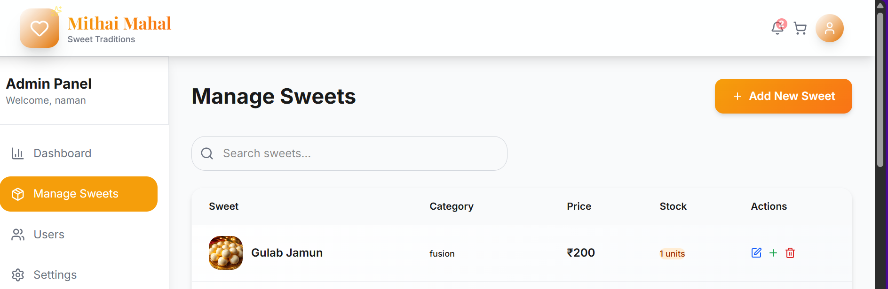

# Sweet Shop Management System

A comprehensive full-stack Sweet Shop Management System built with modern web technologies. This application features a robust REST API with JWT authentication, role-based authorization, inventory management, and a beautiful React frontend with intuitive UI/UX design.

## Table of Contents

- [Technologies Used](#technologies-used)
- [Features](#features)
- [Screenshots](#screenshots)
- [Installation & Setup](#installation--setup)
- [Usage](#usage)
- [API Endpoints](#api-endpoints)
- [Folder Structure](#folder-structure)
- [Contributing](#contributing)
- [License](#license)
- [Contact](#contact)

## Technologies Used

### Frontend
- **React.js** - Modern JavaScript library for building user interfaces
- **Vite** - Fast build tool and development server
- **CSS3** - Custom styling with modern design patterns
- **JavaScript (ES6+)** - Modern JavaScript features

### Backend
- **Node.js** - JavaScript runtime environment
- **Express.js** - Fast, unopinionated web framework
- **MongoDB** - NoSQL database for data storage
- **Mongoose** - MongoDB object modeling for Node.js

### Authentication & Security
- **JWT (JSON Web Tokens)** - Secure authentication
- **bcryptjs** - Password hashing
- **CORS** - Cross-origin resource sharing

### Development & Testing
- **Jest** - JavaScript testing framework
- **Supertest** - HTTP assertion library
- **Nodemon** - Development server with auto-restart
- **MongoDB Memory Server** - In-memory MongoDB for testing

## Features

### 🛍️ User Features
- **Browse Sweets**: View all available sweets with details
- **Search & Filter**: Find sweets by name, category, and price range
- **View Details**: See detailed information about each sweet
- **Purchase Items**: Buy sweets with real-time stock validation
- **User Authentication**: Secure registration and login
- **Responsive Design**: Works perfectly on all devices

### 👨‍💼 Admin Features
- **Sweet Management**: Add, edit, and delete sweets
- **Inventory Control**: Manage stock levels and restock items
- **User Management**: View and manage user accounts
- **Dashboard**: Comprehensive admin dashboard
- **Real-time Updates**: Instant inventory updates
- **Advanced Search**: Filter and search through all sweets

### 🔒 Security Features
- **JWT Authentication**: Secure token-based authentication
- **Role-based Authorization**: Separate user and admin permissions
- **Password Encryption**: Secure password hashing with bcryptjs
- **Protected Routes**: API endpoints protected by authentication middleware

## Screenshots

### Homepage

*Clean and modern homepage showcasing featured sweets*

### Sweet Collection

*Browse all available sweets with search and filter options*

### Sweet Details

*Detailed view of individual sweets with purchase options*

### Admin Dashboard

*Comprehensive admin panel for managing sweets and inventory*

### User Authentication

*Secure user authentication with modern design*

## Installation & Setup

### Prerequisites
- Node.js (v16 or higher)
- MongoDB (local installation or MongoDB Atlas)
- npm or yarn package manager

### Backend Setup

1. **Clone the repository**
   ```bash
   git clone <repository-url>
   cd Sweet-Shop
   ```

2. **Install server dependencies**
   ```bash
   cd server
   npm install
   ```

3. **Environment Configuration**
   Create a `.env` file in the `server` directory:
   ```env
   MONGO_URI=mongodb://localhost:27017
   DB_NAME=sweets-shop-db
   JWT_SECRET=your_super_secure_jwt_secret_key_here
   PORT=5000
   ```

4. **Start the server**
   ```bash
   # Development mode with auto-restart
   npm run dev
   
   # Production mode
   npm start
   ```

5. **Run tests**
   ```bash
   npm test
   ```

### Frontend Setup

1. **Install client dependencies**
   ```bash
   cd client
   npm install
   ```

2. **Start the development server**
   ```bash
   npm run dev
   ```

3. **Build for production**
   ```bash
   npm run build
   ```

The application will be available at:
- **Frontend**: http://localhost:5173
- **Backend API**: http://localhost:5000

## Usage

### For Users

1. **Registration & Login**
   - Create a new account or login with existing credentials
   - Users are automatically assigned the "user" role

2. **Browse Sweets**
   - View all available sweets on the homepage
   - Use search functionality to find specific sweets
   - Filter by category and price range

3. **Purchase Process**
   - Click on any sweet to view details
   - Purchase sweets with real-time stock validation
   - Inventory updates automatically after purchase

### For Admins

1. **Admin Access**
   - Register with role "admin" or have an admin promote your account
   - Access the admin dashboard after login

2. **Sweet Management**
   - **Add New Sweets**: Create new sweet entries with name, category, price, and stock
   - **Edit Sweets**: Update existing sweet information
   - **Delete Sweets**: Remove sweets from the inventory
   - **Restock Items**: Add more quantity to existing sweets

3. **Inventory Monitoring**
   - View real-time stock levels
   - Monitor purchase activities
   - Manage overall inventory health

## API Endpoints

### Authentication Endpoints
| Method | Endpoint | Description | Access |
|--------|----------|-------------|---------|
| POST | `/api/auth/register` | Register new user | Public |
| POST | `/api/auth/login` | User login | Public |

### Sweet Management Endpoints
| Method | Endpoint | Description | Access |
|--------|----------|-------------|---------|
| GET | `/api/sweets` | Get all sweets | Protected |
| GET | `/api/sweets/search` | Search sweets with filters | Protected |
| POST | `/api/sweets` | Create new sweet | Admin Only |
| PUT | `/api/sweets/:id` | Update sweet | Admin Only |
| DELETE | `/api/sweets/:id` | Delete sweet | Admin Only |
| POST | `/api/sweets/:id/purchase` | Purchase sweet | User |
| POST | `/api/sweets/:id/restock` | Restock sweet | Admin Only |

### Example API Usage

**Register a new user:**
```bash
curl -X POST http://localhost:5000/api/auth/register \
  -H "Content-Type: application/json" \
  -d '{"name":"John Doe","email":"john@example.com","password":"password123","role":"user"}'
```

**Login:**
```bash
curl -X POST http://localhost:5000/api/auth/login \
  -H "Content-Type: application/json" \
  -d '{"email":"john@example.com","password":"password123"}'
```

**Create a sweet (Admin only):**
```bash
curl -X POST http://localhost:5000/api/sweets \
  -H "Authorization: Bearer YOUR_JWT_TOKEN" \
  -H "Content-Type: application/json" \
  -d '{"name":"Chocolate Bar","category":"Chocolate","price":25,"quantityInStock":100}'
```

## Folder Structure

```
Sweet-Shop/
├── client/                     # Frontend React application
│   ├── public/                 # Public assets
│   ├── src/                    # Source code
│   │   ├── assets/            # Images and static files
│   │   ├── components/        # React components
│   │   ├── pages/             # Page components
│   │   ├── services/          # API service functions
│   │   ├── App.jsx            # Main App component
│   │   └── main.jsx           # Entry point
│   ├── package.json           # Frontend dependencies
│   └── vite.config.js         # Vite configuration
├── server/                     # Backend Node.js application
│   ├── config/                # Configuration files
│   │   └── db.js              # Database connection
│   ├── controllers/           # Route controllers
│   │   ├── authController.js  # Authentication logic
│   │   └── sweetsController.js # Sweet management logic
│   ├── middlewares/           # Custom middleware
│   │   └── authMiddleware.js  # Authentication middleware
│   ├── models/                # Database models
│   │   ├── User.js            # User model
│   │   └── Sweet.js           # Sweet model
│   ├── routes/                # API routes
│   │   ├── authRoutes.js      # Authentication routes
│   │   └── sweetsRoutes.js    # Sweet management routes
│   ├── tests/                 # Test files
│   │   ├── auth.test.js       # Authentication tests
│   │   └── sweets.test.js     # Sweet management tests
│   ├── .env                   # Environment variables
│   ├── index.js               # Server entry point
│   └── package.json           # Backend dependencies
├── screenshots/               # Application screenshots
└── README.md                  # Project documentation
```

## Contributing

We welcome contributions to the Sweet Shop Management System! Here's how you can help:

### Getting Started
1. Fork the repository
2. Create a feature branch (`git checkout -b feature/amazing-feature`)
3. Make your changes
4. Run tests to ensure everything works
5. Commit your changes (`git commit -m 'Add amazing feature'`)
6. Push to the branch (`git push origin feature/amazing-feature`)
7. Open a Pull Request

### Development Guidelines
- Follow existing code style and conventions
- Write tests for new features
- Update documentation as needed
- Ensure all tests pass before submitting PR

### Areas for Contribution
- UI/UX improvements
- Additional sweet categories
- Enhanced search functionality
- Performance optimizations
- Bug fixes and security improvements


## Contact

**Developer**: Naman Patidar
- **Email**: namanpatidar5555@gmail.com
- **GitHub**: [@naman-ptdr](https://github.com/naman-ptdr)
- **LinkedIn**: [Naman Patidar](https://www.linkedin.com/in/naman-patidar/)

---

### 🚀 Quick Start Commands

```bash
# Clone and setup backend
git clone <repository-url>
cd Sweet-Shop/server
npm install
npm run dev

# Setup frontend (new terminal)
cd ../client
npm install
npm run dev
```


**Happy coding! 🍭**